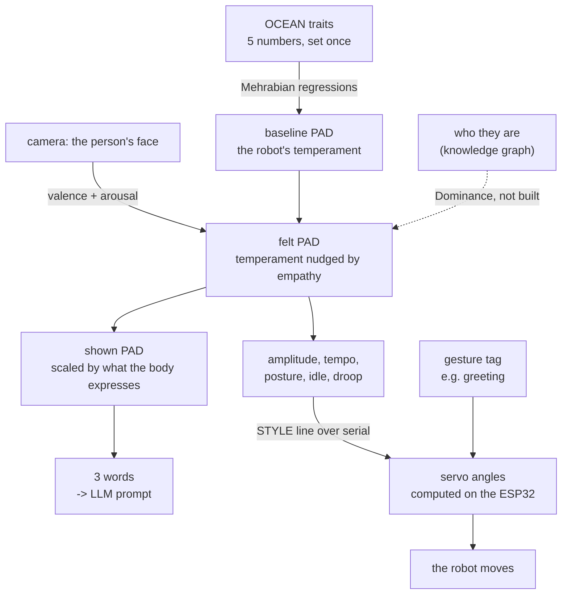

# How the affect model works, from the start

A robot with a fixed personality treats everyone the same. A robot that only
mirrors emotion has no personality at all. This is the machinery that lets it do
both: keep a stable character while still reacting to the person in front of it —
and lets two different robots share a design yet read as different creatures.

The whole chain, from a face to a servo angle:

```
camera -> valence/arousal -> PAD -> five style values -> servo angles
```

Implemented across [`affect.py`](affect.py) and
[`../SERVO_STYLE/servo_style.py`](../SERVO_STYLE/servo_style.py), verified by two
test suites. **Every number in this document was produced by running that code**,
including the worked examples in §9 — none of it is illustrative.

Section 10 says plainly which parts come from published work and which are
proposals of mine, because the two get cited very differently.

---

## 1. The problem it solves

Three things want to influence how the robot behaves, and they conflict:

| influence | wants to |
|---|---|
| its **personality** | stay the same, so it has a recognisable character |
| the **person's emotion** | change moment to moment, so it seems responsive |
| the **relationship** | change slowly, so familiarity can grow |

Wire them together naively and they fight — a persona setting gets overwritten by
a smile, or an empathic response gets flattened by the persona. The trick is to
put all three in **one continuous space** where each one owns a *different
direction*, so they add instead of competing.

That space is **PAD**: Pleasure, Arousal, Dominance.

```
personality  ->  sets the baseline position
emotion      ->  moves Pleasure and Arousal
relationship ->  moves Dominance
```

Nothing overwrites anything. Each influence pushes along its own axis.

---

## 2. The pipeline



The pipeline is unchanged. What changed is only where the numbers in the
PAD → style step come from — §7.

Every stage is built except the relationship → Dominance path, which needs the
knowledge graph. `idle` is computed and sent but the firmware does not act on it
yet.

---

## 3. Stage one — personality becomes a coordinate

The persona is five numbers on `[-1, +1]`, the **OCEAN** traits: Openness,
Conscientiousness, Extraversion, Agreeableness, Neuroticism. Zero means average.

Rather than wiring traits to motors directly, they go through PAD, using
Mehrabian's temperament regressions (as used by the ALMA model):

```
P  = 0.21·E + 0.59·A + 0.19·N
Ar = 0.15·O + 0.30·A − 0.57·N
D  = 0.25·O + 0.17·C + 0.60·E − 0.32·A
```

Read what dominates each line — it explains a lot of the behaviour:

- **Agreeableness** carries Pleasure (0.59). Warmth makes a robot pleasant.
- **Neuroticism** carries Arousal *negatively* (−0.57). See the caveat in §9.
- **Extraversion** carries Dominance (0.60). This is the trait that separates our
  two robots.

The two published personas:

| | O | C | E | A | N | → | P | Ar | D |
|---|---|---|---|---|---|---|---|---|---|
| CHATBOX | −0.5 | +0.2 | −0.6 | +0.6 | +0.2 | | **+0.27** | **−0.01** | **−0.64** |
| ELLEBOT | +0.5 | +0.4 | +0.7 | +0.6 | −0.4 | | **+0.42** | **+0.48** | **+0.42** |

Agreeableness is held equal at +0.6, so both are warm. Extraversion runs opposite,
which swings Dominance by more than a full unit. **That single trait is why they
feel like different characters before either one speaks.**

---

## 4. Stage two — the face becomes a coordinate

Russell's **circumplex** puts emotion on two axes: valence (pleasant ↔
unpleasant) and arousal (activated ↔ quiet). "Angry" and "sad" share low valence
but sit at opposite ends of arousal — a single positive/negative score would
collapse them.

Those two axes map onto PAD's Pleasure and Arousal almost one to one.

**Why only two axes, and why that is the point.** Faces reliably carry pleasure
and arousal — the two dimensions of core affect. Dominance is poorly recoverable
from expression: it reflects social standing between two parties, not a momentary
look. So the face is deliberately given **no vote on Dominance at all**. That
comes from recognising *who* the person is.

This is why a two-axis model is the right tool rather than a limitation: it is
silent on exactly the axis it should be silent on.

The camera side uses a model that reports valence and arousal directly
(`enet_b0_8_va_mtl`, EfficientNet-B0 trained on AffectNet), so no lookup table is
needed. A classifier-plus-lookup fallback exists in `CATEGORY_VA` for comparison.

---

## 5. Stage three — fusion

```
felt.P  = baseline.P  + empathy · (valence − baseline.P)
felt.Ar = baseline.Ar + empathy · (arousal − baseline.Ar)
felt.D  = baseline.D                                    ← untouched
```

`empathy` (default **0.60**) is how far the person's expression drags the robot
off its own temperament:

- `0.0` — ignores you completely, sits at its persona forever
- `0.6` — moves most of the way, but its character still shows
- `1.0` — pure mirror, no personality left

Because it is a fraction *of the gap*, a neutral face pulls the robot toward
neutral rather than away, and the robot always relaxes back to its baseline when
nothing is detected. That is the decay behaviour, for free, with no timer.

---

## 6. Stage four — the body

Two robots can hold the same temperament and still not show the same amount of
it. ELLEBOT has a wheeled base that can approach and turn, plus large fan ears
devoted to amplifying valence. CHATBOX is a fixed tabletop unit. Same feeling,
different bandwidth to express it.

```
shown = show_fraction · felt
```

| | show | why |
|---|---|---|
| CHATBOX | 0.30 | fixed tabletop, 12-DOF upper face |
| ELLEBOT | 1.00 | wheeled base, fan ears, 12-DOF upper face |

This is the layer that makes the *embodiment* matter independently of the
persona, and it is why the same trait vector lands in two different places.

---

## 7. Stage five — two outputs

The coordinate drives language and movement at the same time.

### Language: three words

Each axis is banded into a descriptor, and the triplet goes into the LLM system
prompt so word choice follows the affective state.

CHATBOX's published coordinate returns **"warm, calm, reserved"** — which is the
paper's own worked example, so the bands are calibrated against it.

### Movement: five parameters

Five values, computed straight from the PAD coordinate and clamped. **Two come
from a published equation; three are ours.** The split is marked on every one.

```
amplitude = Sp = (D + 1) / 2            PUBLISHED   clamp 0.30 … 1.00
tempo     = Ve = fv(P, Ar, D)           PUBLISHED   clamp 0.50 … 1.60
posture   = 0.70·D + 0.30·P             ours        clamp −1 … +1
idle      = 0.45 + 0.40·Ar              ours        clamp 0.05 … 1.00
droop     = −P × 1.4                    ours        clamp −1 … +1
```

#### The published half

[Hagane & Venture (2022)][hagane], *Machines* 10(12):1118, following
[Claret, Venture & Basañez (2017)][claret], *Int. J. Social Robotics* 9:277–292.
Both map PAD to motion features by — their words — "a simple linear formula".
Their **Eq. 9** gives three features on [0,1] from a PAD point on [−1,1]³:

```
Jr (jerkiness)      = (1 − P) / 2
Ve (velocity)       = fv(P, A, D)
Sp (spatial extent) = (D + 1) / 2
```

and **Eq. A1** defines `fv`:

```
Pn, An, Dn = P+1, A+1, D+1
r  = √(An² + Dn²)
β  = arccos(Dn / r)
S  = 2 + (2−√2)·sin(2β + π)
fv = 0.125 · (r / S) · (4 − Pn)
```

`Sp` is amplitude — the paper defines Extent as *"how large the gestures of the
hands and arms are"*. `Ve` is tempo. `Jr` is dropped: this firmware plays a
fixed five-step sequence and controls only `step_ms`, so there is no actuator
for jerk. Claret's third feature is *gaze*, which Hagane replaced with `Sp`
because a robot arm has no eyes; this robot has no gaze servos either.

Test §9 reproduces all four anchor values the paper states in its Eq. 10 —
Hostile → 1.0, Exuberant → 0.5, Anxious → 0.5, Bored → 0.0 — which is the check
that the transcription is faithful.

The only added step: `Sp` and `Ve` are dimensionless indices on [0,1], while
amplitude is a fraction of authored servo travel and tempo a playback
multiplier. Each is mapped affinely onto the range already documented in
`STYLE_LIMITS`. That is a unit conversion onto our own range — no coefficient is
chosen.

#### Two things this equation does that are worth knowing

**Amplitude cannot respond to the person.** `Sp` depends on Dominance alone, and
the face never moves Dominance (§4). So amplitude is fixed per persona —
CHATBOX 0.42, ELLEBOT 0.80 — whatever expression is detected. Consistent with
this project's own design, but a real consequence, and test §13 pins it.

**Tempo rises as Pleasure falls.** `fv`'s last term is `(4 − Pn)`, so an
unpleasant face comes out *faster*. That follows Wallbott's finding that high
kinetic energy reads as anger, and it is why the paper's fastest anchor is
Hostile. **It contradicts the deck's p.15 claim** that mixing valence into speed
"would make a sad robot merely slow" — the published equation mixes valence into
speed, in the opposite direction. It also sits against
[Gross, Crane & Fredrickson (2012)][gross], who found sadness *slowest* in gait.
Measured output: anger 0.88, happy 0.76, neutral 0.76, sad 0.75. Anger separates
well; happy and sad barely differ.

The authors flag a related limitation themselves (their §7): the `Ve` values
*"were not scattered between 0 and 1 but clustered between 0 and 0.5, resulting
in similar movements … except for the case of 'hostile'."*

#### The unpublished half

`posture`, `idle` and `droop` are the deck's own equations, unchanged. **No
published PAD equation for any of the three could be found.** Claret uses gaze
for Dominance, Hagane uses spatial extent, and neither models carriage, resting
stir rate, or a signed vertical tint. They stay proposals — §10 keeps the tally.

At rest, the two personas:

| | amplitude | tempo | posture | droop | idle |
|---|---|---|---|---|---|
| CHATBOX | 0.42 | 0.74 | −0.37 | −0.37 | 0.45 |
| ELLEBOT | 0.80 | 1.01 | +0.42 | −0.59 | 0.64 |

[hagane]: https://doi.org/10.3390/machines10121118
[claret]: https://link.springer.com/article/10.1007/s12369-016-0387-2

### Superseded: what else was tried

[PERFORM][perform] (Durupinar, Kapadia, Deutsch, Neff & Badler, ACM TOG 36(4),
2017) publishes `OCEAN → Laban Effort → motion parameters`, validated by a
perception study, and is a tempting fit because it already uses OCEAN. It was
built and then dropped, for two reasons worth recording:

- It takes **OCEAN**, not PAD, and has no emotion term. Bridging it into PAD
  required a least-squares fit whose R² was 0.994 on one Effort factor but
  0.36–0.56 on the other three — PAD is a 3-dimensional projection of a
  5-dimensional trait space, so most of what PERFORM keys on is unrecoverable.
- Those bridge coefficients would have been **computed here rather than cited**,
  which is exactly what this model is trying to stop doing.

The Hagane & Venture equation above is used instead because it takes PAD
directly, needs no bridge, and reproduces its own published anchor values.

One artefact of that work is worth keeping, because it explains §10's long-
standing quirk. Mehrabian has `Ar = … − 0.57N` while PERFORM has
`Time = … + 0.97N`: the two disagree about neuroticism. The reason is that
Mehrabian's Arousal is *trait arousability*, a disposition, while Laban's Time
is momentary agitation. Different quantities sharing a name. Anything that
routes movement through PAD's Arousal axis inherits that, and it is worth a
sentence in the paper.

[perform]: https://www.cs.ucdavis.edu/~neff/papers/PERFORM_TOG.pdf

---

## 8. Stage six — parameters to servo angles

Built, in [`../SERVO_STYLE/`](../SERVO_STYLE/). Two things happen here that the
paper does not describe.

### The fifth parameter

Four parameters cannot make a greeting look sad. Amplitude only makes it
*smaller* — a small wave is still a happy wave. Tempo only makes it slower.
Neither carries valence.

So there is a fifth, **`droop`**: a signed offset that pushes the expressive
servos down when the expression is unpleasant and lifts them when it is
pleasant, on top of whatever gesture is playing.

**This is not an invention of ours, and this document used to claim it was.**
`droop` is **Sinking/Rising**, the vertical axis of Laban Shape — one of the
three Shape dimensions, and a named movement parameter since Laban. What is
genuinely ours is the *gain*: `droop = −P × 1.4`, with the 1.4 chosen by eye.
No published equation maps PAD to a signed vertical tint.

It is also the parameter that now does the most work, because of the two
properties in §7: amplitude is fixed per persona, and tempo speeds *up* as
Pleasure falls. Neither can make a greeting look sad, so droop carries valence
alone.

### Embodiment enters once, not twice

```
shown = show_fraction × felt        CHATBOX 0.30, ELLEBOT 1.00
```

That is the only embodiment scaling. There used to be a second one — a per-robot
`TRAVEL` fraction (CHATBOX 0.65, ELLEBOT 1.00) multiplying amplitude and droop
on the way to the servos — and it has been **removed**.

Two reasons. It no longer matched the deck's own worked numbers (§9). And it was
harmful: with travel, CHATBOX's amplitude came out at 0.28 and saturated against
the 0.30 clamp floor, so it played every gesture at minimum size in every mood.
Without it CHATBOX sits at 0.42 with room to vary, and the two robots still
separate cleanly because `amplitude = (D+1)/2` already carries the persona
difference.

### What the firmware already had

A tag arrives as a string, is looked up in `listOfMoveSets`, and a fixed five-step
sequence plays. Each step holds one *symbol* per servo — `D` (down), `M` (middle),
`U` (up) — and `setNeck` / `setShoulder` / `setEyes` / `setBrows` / `setEars` /
`setHand` convert that symbol into a hardcoded angle. Identical every time, for
every persona, in every mood.

Each servo's `M` pose is its **rest**, and that is what amplitude scales away
from:

| servo | rest | D | M | U | range |
|---|---|---|---|---|---|
| Ears | 130 | 120 | 130 | 165 | 120–165 |
| RBrow / LBrow | 120 / 60 | 150 / 30 | 120 / 60 | 90 / 90 | 90–150 / 30–90 |
| REyelid / LEyelid | 110 / 70 | 90 / 90 | 110 / 70 | 130 / 50 | 90–130 / 50–90 |
| RNeck / LNeck | 82 / 103 | 70 / 110 | 82 / 103 | 100 / 80 | 70–100 / 80–120 |
| RShoulder / LShoulder | 140 / 40 | 50 / 130 | 140 / 40 | 170 / 10 | 50–170 / 10–130 |
| RHand / LHand | 90 / 90 | 50 / 130 | 90 / 90 | 150 / 30 | 50–150 / 30–130 |

### The conversion, per servo, per step

```
1. symbol           -> target        exactly as the stock firmware does
2. angle = rest + amplitude × (target − rest)
3. angle += droop   × DROOP_DEG[servo]
4. angle += posture × POSTURE_DEG[servo]      neck and shoulders only
5. clamp to the servo's stock range
```

Degrees at full deflection. Left-hand servos take the negated weight, because
both sides sit at 90 ± an offset — a mood has to move them oppositely or the robot
ends up lopsided. Hands get zero droop: a drooping hand reads as a failed servo,
not a mood.

**The channel set is well supported; the magnitudes are not.**
[Coulson (2004)][coulson] built postural emotion expression out of six joint
rotations — head bend, chest bend, abdomen twist, shoulder ad/abduction,
shoulder swing, elbow bend — and found sadness at forward head bend with the
arms at the side of the trunk, anger at backward head bend with the arms out.
The table above is essentially Coulson's six minus the joints this hardware does
not have, plus ears and lids. The *signs* and the *rank order* follow him and
[Wallbott (1998)][wallbott]. The *degrees* are ours and are still tuned by eye —
nobody publishes them, because they are specific to a robot's geometry.

One finding argues against a choice here.
[Xu, Broekens, Hindriks & Neerincx (2013)][xu] modulated NAO behaviours for mood
and found the parameters that carried it best were **hand height**, amplitude,
head position, and motion speed. Hand height is on that list, and `DROOP_DEG`
sets both hands to **0**. The reasoning above ("a drooping hand reads as a
failed servo") is a plausible hardware-specific objection, but it is untested
and it discards a channel the literature ranks highly. Worth trying on the real
robot before publication.

[coulson]: https://link.springer.com/article/10.1023/B:JONB.0000023655.25550.be
[xu]: https://ieeexplore.ieee.org/document/6628534/

| servo | DROOP_DEG | POSTURE_DEG |
|---|---|---|
| Ears | −20 | 0 |
| RBrow / LBrow | +12 / −12 | 0 |
| REyelid / LEyelid | −10 / +10 | 0 |
| RNeck / LNeck | −8 / +8 | +10 / −10 |
| RShoulder / LShoulder | −12 / +12 | +8 / −8 |
| RHand / LHand | 0 | 0 |

Tempo never touches an angle — it divides the step timer only:

```
step_ms = 900 / tempo
```

Keeping that separation means a tempo bug can make the robot sluggish but can
never make it reach somewhere new.

### Two properties worth knowing

**Clamping to the stock range** means styling can never command a pose the
unstyled firmware would not have commanded. The test suite checks all 189
tag/style combinations for this.

**Amplitude therefore stops at 1.00.** Each servo has only three symbols, so `D`
and `U` already *are* the ends of its range — asking for 1.3 of the way to an end
stop just saturates. The authored gestures are treated as full expression, which
styling damps.

### Transport

Five floats cross the wire, not 55 angles. The ESP32 keeps the move sets and
computes the angles itself.

```
STYLE 0.34 0.63 -0.54 +0.29 0.36      only when the mood changes
greeting                               every gesture
```

Style is sticky — the firmware holds those five values and applies them to every
gesture until a new `STYLE` arrives. Tag messages are unchanged, so the existing
protocol still works, and if a `STYLE` line never arrives the robot behaves exactly
as it did before.

---

## 9. End to end, with real numbers

Both robots see a **sad** face, and both are asked to play `greeting`. Every
figure below came from running the code.

### Traits to a style

| | CHATBOX | ELLEBOT |
|---|---|---|
| traits | O−0.5 C+0.2 E−0.6 A+0.6 N+0.2 | O+0.5 C+0.4 E+0.7 A+0.6 N−0.4 |
| baseline PAD | +0.266, −0.009, −0.643 | +0.425, +0.483, +0.421 |
| face `sad` | v −0.70, a −0.38 | v −0.70, a −0.38 |
| felt (empathy 0.60) | −0.314, −0.232, −0.643 | −0.250, −0.035, +0.421 |
| shown | −0.094, −0.069, −0.193 *(30%)* | −0.250, −0.035, +0.421 *(100%)* |
| five params | amp **0.42**, tempo 0.81, post −0.54, droop **+0.44** | amp **0.80**, tempo 1.03, post +0.22, droop **+0.35** |
| **wire** | `STYLE 0.42 0.75 -0.54 +0.44 0.36` | `STYLE 0.80 1.03 +0.22 +0.35 0.44` |
| step timing | 900 / 0.75 = **1202 ms** | 900 / 1.03 = **876 ms** |

`droop` at rest is about −0.55 for both robots; the sad face drives it to +0.22
and +0.46 through the −1.181 loading on Pleasure. That crossing from lifted to
sagging is the whole point of the parameter.

### One servo, all five steps of the conversion

CHATBOX's right shoulder, `greeting` step 0, where the move set says `U`:

```
1  symbol U                          -> 170
2  rest + amp × (target − rest)      = 140 + 0.42 × (170 − 140)  = 152.6
3  + droop × −12                     = 151.5 + (+0.221 × −12)    = 148.8
4  + posture × +8                    = 148.8 + (−0.212 × +8)     = 147.1
5  clamp to 50..170                  -> 147
                                        (stock would be 170)
```

ELLEBOT, identical gesture, identical face:

```
2  140 + 0.687 × 30       = 160.6
3  160.6 + (+0.462 × −12) = 155.1
4  155.1 + (+0.235 × +8)  = 157.0
5  -> 157
```

Same tag, same face. CHATBOX barely lifts its arm, its head dips, and the whole
gesture takes 5.6 s against ELLEBOT's 3.9 s. ELLEBOT performs most of the
gesture but is still visibly tinted. Neither was given a different move set, and
the hands stay put in both — see the caveat about hand height in §8.

Reproduce all of it with `python SERVO_STYLE/preview.py greeting --emotion sad
--wire`, which prints the full servo table.

---

## 10. What is established and what is a guess

Worth being clear about, because the two get cited very differently.

Note on wording: earlier versions of this document said "the paper" throughout,
meaning our own RO-MAN design-competition deck. That is circular — a reviewer
asking "which paper?" gets pointed back at us. Below, *published* means someone
else's peer-reviewed result.

### Published, and used as published

| | source |
|---|---|
| OCEAN → PAD equations | Mehrabian via ALMA. Reproduces our Table I to two decimals. **Unchanged.** |
| Russell's two axes for the face | And the reason Dominance is excluded. **Unchanged.** |
| **`amplitude` = (D+1)/2** | [Hagane & Venture (2022)][hagane] Eq. 9, `Sp`. Used verbatim. |
| **`tempo` = fv(P,Ar,D)** | [Hagane & Venture (2022)][hagane] Eq. A1, `Ve`. Used verbatim; test §9 reproduces all four anchor values from their Eq. 10. |
| `DROOP_DEG` channel set and signs | [Coulson (2004)][coulson]'s six joint rotations, minus what this hardware lacks. |
| Symbol → angle tables | **Transcribed** from `ServoControl.ino`; tests assert a neutral style reproduces stock firmware exactly. |

The only step added around the published equations: `Sp` and `Ve` are
dimensionless indices on [0,1], so each is mapped affinely onto the range this
project already documents. A unit conversion, not a coefficient.

### Still ours — no published equation exists for these

Searched for and not found: no paper maps PAD to carriage, resting stir rate, or
a signed vertical tint. Claret uses gaze for Dominance; Hagane uses spatial
extent; neither models these three.

| | status |
|---|---|
| `posture = 0.70·D + 0.30·P` | **Proposal.** The deck, p.15. |
| `idle = 0.45 + 0.40·Ar` | **Proposal.** The deck, p.15. Firmware ignores it today anyway. |
| `droop = −P × 1.4` | **Proposal.** The deck, p.16. The gain is by eye. |
| **`droop` as a parameter** | Not an invention, even if its gain is: it is Laban **Sinking/Rising**, the vertical Shape axis. This document previously called it "an addition, not an implementation". That was wrong. |
| `empathy = 0.60` | **Proposal.** Tune with `[` and `]` in the demo. |
| `show`: 0.30 / 1.00 | **Proposal.** No published number for expressive bandwidth. |
| `DROOP_DEG` / `POSTURE_DEG` **magnitudes** | **Proposal.** Signs and rank order are Coulson's; the degrees are tuned by eye and robot-specific. |
| Descriptor bands | **Fitted** so CHATBOX returns our own worked example. |
| Zero droop on the hands | **Ours, and contradicted** — see the Xu et al. note in §8. |
| Relationship → Dominance | **Not written.** Needs the knowledge graph. |

### Two places the published equation disagrees with this deck

Both are consequences of using [Hagane & Venture][hagane] as published, and both
belong in the paper rather than being quietly absorbed.

**1. Amplitude no longer responds to the person.** `Sp = (D+1)/2` uses Dominance
alone, and the face never moves Dominance. So amplitude is fixed per persona
(CHATBOX 0.42, ELLEBOT 0.80) whatever expression is detected. The deck's p.15
had amplitude Arousal-led, which did respond. Test §13 pins the new behaviour.

**2. Tempo now rises as Pleasure falls.** `fv`'s last term is `(4 − Pn)`, so an
unpleasant face is *faster*. The deck's p.15 says Pleasure is excluded from
tempo precisely so a sad robot is not "merely slow"; the published equation
includes it, with the opposite sign to intuition. It follows Wallbott's finding
that high kinetic energy reads as anger, but it sits against
[Gross, Crane & Fredrickson (2012)][gross], who found sadness slowest in gait.
Measured: anger 0.88, happy 0.76, neutral 0.76, sad 0.75 — anger separates,
happy and sad barely differ. The authors note the same clustering themselves.

If either matters more than having a citation, say so and the deck's original
equation goes back in for that row.

### The quirk, still open

In Mehrabian's regressions Neuroticism *raises* Pleasure (`+0.19N`) and *lowers*
Arousal (`−0.57N`), so a high-N persona comes out calm and faintly pleasant
rather than anxious.

Building and discarding a [PERFORM][perform]-based model (§7) turned up a likely
explanation: PERFORM has `Time = … + 0.97N`, treating high neuroticism as quick
and agitated, the opposite of Mehrabian. The two are measuring different things
— Mehrabian's Arousal is *trait arousability*, a disposition, while Laban's Time
is momentary agitation. Different quantities sharing a name.

That resolves the confusion but does not change any equation here, since
`fv` takes Arousal directly rather than through a trait model. Worth one
sentence in the paper.

---

## 11. Where each piece lives

### AFFECT_LAB — persona, emotion, and the four parameters

| stage | code |
|---|---|
| OCEAN → PAD | `affect.to_pad`, weights in `affect.WEIGHTS` |
| the two personas | `affect.ROBOTS` |
| face → valence/arousal | `webcam_demo.read_va` |
| fusion | `affect.feel`, gain in `affect.EMPATHY` |
| body scaling | `affect.show` |
| naming a coordinate | `affect.affect_name`, `affect.SECTORS` |
| descriptor words | `affect.descriptors`, `affect.BANDS` |
| PAD → the five values | `affect.gesture_style`, limits in `affect.STYLE_LIMITS` |
| the two published ones | `affect._spatial_extent` (Eq. 9), `affect._velocity` (Eq. A1) |
| whole chain in one call | `affect.pipeline` |

### SERVO_STYLE — parameters to angles, and the wire

| stage | code |
|---|---|
| move sets and symbol→angle tables | `servo_style.MOVE_SETS`, `servo_style.SERVOS` |
| droop / posture weights | `servo_style.DROOP_DEG`, `POSTURE_DEG` |
| one servo, one step | `servo_style.resolve_servo` |
| a whole tag | `servo_style.resolve_gesture` |
| the wire format | `servo_style.wire_message`, `parse_wire` |
| persona+emotion → five values | `live_demo.current_style` |
| the serial link | `live_demo.RobotLink` |
| the firmware | `firmware/ChatBoxPlus_Styled/` — `StyleControl.h` holds the weights |

### Running it

```bash
python AFFECT_LAB/test_affect.py           # the affect maths
python SERVO_STYLE/test_servo_style.py     # the angle maths
python AFFECT_LAB/webcam_demo.py           # watch the coordinate move
python SERVO_STYLE/preview.py greeting --emotion sad    # the angle table
python SERVO_STYLE/live_demo.py            # the whole chain, driving the robot
```

The two test suites need no camera and no hardware. `live_demo.py` falls back to
preview-only when no ESP32 is attached, so it is safe to run either way.
