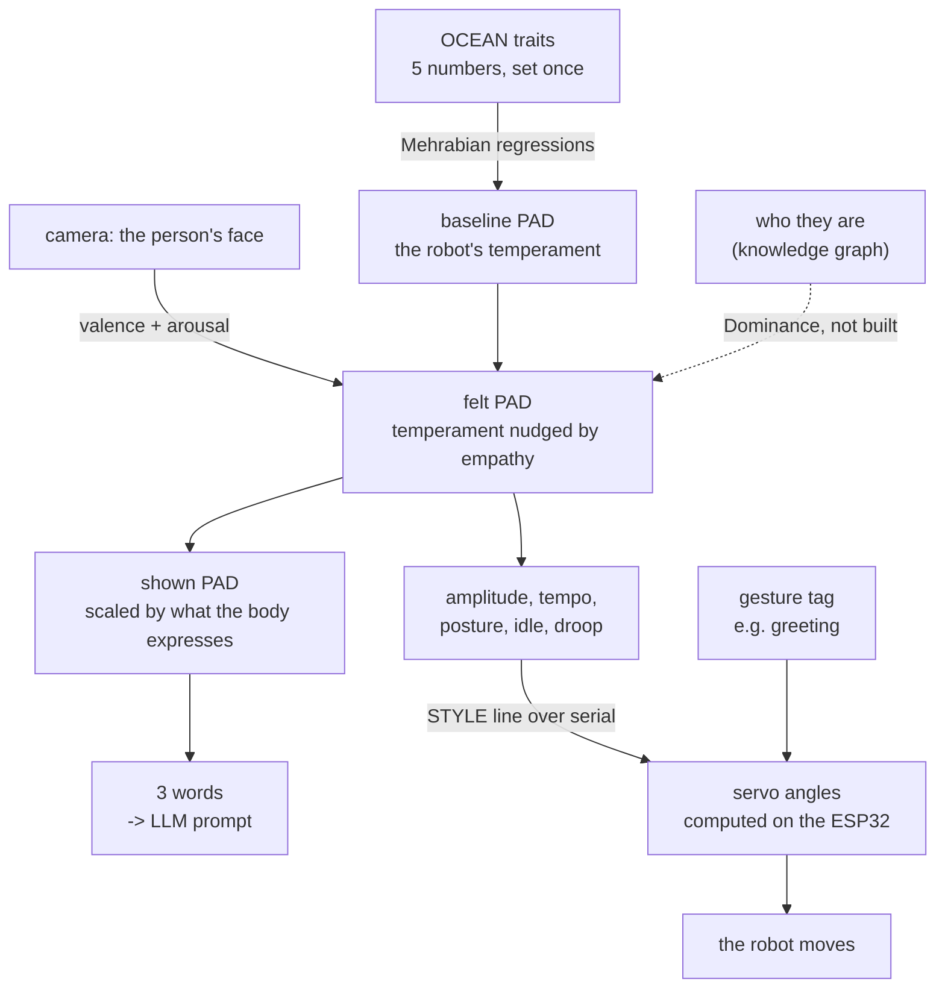

# How the affect model works, from the start

A robot with a fixed personality treats everyone the same. A robot that only
mirrors emotion has no personality at all. This is the machinery that lets it do
both: keep a stable character while still reacting to the person in front of it —
and lets two different robots share a design yet read as different creatures.

The whole chain, from a face to a servo angle:

```
camera -> valence/arousal -> PAD -> five style values -> servo angles
```

Implemented across [`affect.py`](affect.py) and
[`../SERVO_STYLE/servo_style.py`](../SERVO_STYLE/servo_style.py), verified by two
test suites. **Every number in this document was produced by running that code**,
including the worked examples in §9 — none of it is illustrative.

Section 10 says plainly which parts come from published work and which are
proposals of mine, because the two get cited very differently.

---

## 1. The problem it solves

Three things want to influence how the robot behaves, and they conflict:

| influence | wants to |
|---|---|
| its **personality** | stay the same, so it has a recognisable character |
| the **person's emotion** | change moment to moment, so it seems responsive |
| the **relationship** | change slowly, so familiarity can grow |

Wire them together naively and they fight — a persona setting gets overwritten by
a smile, or an empathic response gets flattened by the persona. The trick is to
put all three in **one continuous space** where each one owns a *different
direction*, so they add instead of competing.

That space is **PAD**: Pleasure, Arousal, Dominance.

```
personality  ->  sets the baseline position
emotion      ->  moves Pleasure and Arousal
relationship ->  moves Dominance
```

Nothing overwrites anything. Each influence pushes along its own axis.

---

## 2. The pipeline



Every stage is built except the relationship → Dominance path, which needs the
knowledge graph. `idle` is computed and sent but the firmware does not act on it
yet.

---

## 3. Stage one — personality becomes a coordinate

The persona is five numbers on `[-1, +1]`, the **OCEAN** traits: Openness,
Conscientiousness, Extraversion, Agreeableness, Neuroticism. Zero means average.

Rather than wiring traits to motors directly, they go through PAD, using
Mehrabian's temperament regressions (as used by the ALMA model):

```
P  = 0.21·E + 0.59·A + 0.19·N
Ar = 0.15·O + 0.30·A − 0.57·N
D  = 0.25·O + 0.17·C + 0.60·E − 0.32·A
```

Read what dominates each line — it explains a lot of the behaviour:

- **Agreeableness** carries Pleasure (0.59). Warmth makes a robot pleasant.
- **Neuroticism** carries Arousal *negatively* (−0.57). See the caveat in §9.
- **Extraversion** carries Dominance (0.60). This is the trait that separates our
  two robots.

The two published personas:

| | O | C | E | A | N | → | P | Ar | D |
|---|---|---|---|---|---|---|---|---|---|
| CHATBOX | −0.5 | +0.2 | −0.6 | +0.6 | +0.2 | | **+0.27** | **−0.01** | **−0.64** |
| ELLEBOT | +0.5 | +0.4 | +0.7 | +0.6 | −0.4 | | **+0.42** | **+0.48** | **+0.42** |

Agreeableness is held equal at +0.6, so both are warm. Extraversion runs opposite,
which swings Dominance by more than a full unit. **That single trait is why they
feel like different characters before either one speaks.**

---

## 4. Stage two — the face becomes a coordinate

Russell's **circumplex** puts emotion on two axes: valence (pleasant ↔
unpleasant) and arousal (activated ↔ quiet). "Angry" and "sad" share low valence
but sit at opposite ends of arousal — a single positive/negative score would
collapse them.

Those two axes map onto PAD's Pleasure and Arousal almost one to one.

**Why only two axes, and why that is the point.** Faces reliably carry pleasure
and arousal — the two dimensions of core affect. Dominance is poorly recoverable
from expression: it reflects social standing between two parties, not a momentary
look. So the face is deliberately given **no vote on Dominance at all**. That
comes from recognising *who* the person is.

This is why a two-axis model is the right tool rather than a limitation: it is
silent on exactly the axis it should be silent on.

The camera side uses a model that reports valence and arousal directly
(`enet_b0_8_va_mtl`, EfficientNet-B0 trained on AffectNet), so no lookup table is
needed. A classifier-plus-lookup fallback exists in `CATEGORY_VA` for comparison.

---

## 5. Stage three — fusion

```
felt.P  = baseline.P  + empathy · (valence − baseline.P)
felt.Ar = baseline.Ar + empathy · (arousal − baseline.Ar)
felt.D  = baseline.D                                    ← untouched
```

`empathy` (default **0.60**) is how far the person's expression drags the robot
off its own temperament:

- `0.0` — ignores you completely, sits at its persona forever
- `0.6` — moves most of the way, but its character still shows
- `1.0` — pure mirror, no personality left

Because it is a fraction *of the gap*, a neutral face pulls the robot toward
neutral rather than away, and the robot always relaxes back to its baseline when
nothing is detected. That is the decay behaviour, for free, with no timer.

---

## 6. Stage four — the body

Two robots can hold the same temperament and still not show the same amount of
it. ELLEBOT has a wheeled base that can approach and turn, plus large fan ears
devoted to amplifying valence. CHATBOX is a fixed tabletop unit. Same feeling,
different bandwidth to express it.

```
shown = show_fraction · felt
```

| | show | why |
|---|---|---|
| CHATBOX | 0.30 | fixed tabletop, 12-DOF upper face |
| ELLEBOT | 1.00 | wheeled base, fan ears, 12-DOF upper face |

This is the layer that makes the *embodiment* matter independently of the
persona, and it is why the same trait vector lands in two different places.

---

## 7. Stage five — two outputs

The coordinate drives language and movement at the same time.

### Language: three words

Each axis is banded into a descriptor, and the triplet goes into the LLM system
prompt so word choice follows the affective state.

CHATBOX's published coordinate returns **"warm, calm, reserved"** — which is the
paper's own worked example, so the bands are calibrated against it.

### Movement: four parameters

```
amplitude = 0.75 + 0.45·Ar + 0.20·D      clamp 0.30 … 1.30
tempo     = 0.85 + 0.55·Ar + 0.15·D      clamp 0.50 … 1.60
posture   = 0.70·D  + 0.30·P             clamp −1 … +1
idle      = 0.45 + 0.40·Ar               clamp 0.05 … 1.00
```

| parameter | means | driven by |
|---|---|---|
| **amplitude** | how *far* a gesture travels from neutral | Arousal, then Dominance |
| **tempo** | how *fast* it plays | Arousal |
| **posture** | resting carriage of neck and shoulders, withdrawn ↔ open | Dominance, then Pleasure |
| **idle** | how often it stirs between gestures | Arousal |

**Pleasure is absent from amplitude and tempo on purpose.** Valence decides
*which* gesture plays — a wave rather than a slump. Arousal and Dominance decide
*how* it is performed. Mixing valence into speed would make a happy robot fast
and a sad robot slow, which is not what sadness looks like.

At rest, the two personas:

| | amplitude | tempo | posture | idle |
|---|---|---|---|---|
| CHATBOX | 0.62 | 0.75 | −0.37 | 0.45 |
| ELLEBOT | 1.05 | 1.18 | +0.42 | 0.64 |

Small slow gestures from a withdrawn posture, versus big quick ones from an open
posture. That is the paper's "a broad, brisk wave from ELLEBOT, a slow, gentle
one from CHATBOX" — as numbers rather than adjectives.

Note these are computed from **`felt`**, not `shown`. The body's display fraction
and amplitude describe the same restraint; applying both would count it twice.

---

## 8. Stage six — parameters to servo angles

Built, in [`../SERVO_STYLE/`](../SERVO_STYLE/). Two things happen here that the
paper does not describe.

### The fifth parameter

The paper's four cannot make a greeting look sad. Amplitude only makes it
*smaller* — a small wave is still a happy wave. Tempo only makes it slower.
Neither carries valence.

So there is a fifth, **`droop`**: a signed offset that pushes the expressive
servos down when the coordinate is unpleasant and lifts them when it is pleasant,
on top of whatever gesture is playing.

```
droop = −felt.P × 1.4 × travel        clamped −1 … +1
```

Derived from `felt`, not `shown`: the body's display fraction and amplitude
describe the same restraint, so using the scaled coordinate would apply it twice.

### Travel — the mechanical half of embodiment

```
amplitude_sent = amplitude × travel
```

| | travel | |
|---|---|---|
| CHATBOX | 0.65 | tabletop: the same gestures, kept small |
| ELLEBOT | 1.00 | mobile: performed at authored size |

Deliberately **not** the `show` fractions from §6 (0.30 / 1.00). Reusing those
multiplies the restraint twice and lands CHATBOX at 0.19 amplitude, which does not
read as reserved — it reads as broken.

### What the firmware already had

A tag arrives as a string, is looked up in `listOfMoveSets`, and a fixed five-step
sequence plays. Each step holds one *symbol* per servo — `D` (down), `M` (middle),
`U` (up) — and `setNeck` / `setShoulder` / `setEyes` / `setBrows` / `setEars` /
`setHand` convert that symbol into a hardcoded angle. Identical every time, for
every persona, in every mood.

Each servo's `M` pose is its **rest**, and that is what amplitude scales away
from:

| servo | rest | D | M | U | range |
|---|---|---|---|---|---|
| Ears | 130 | 120 | 130 | 165 | 120–165 |
| RBrow / LBrow | 120 / 60 | 150 / 30 | 120 / 60 | 90 / 90 | 90–150 / 30–90 |
| REyelid / LEyelid | 110 / 70 | 90 / 90 | 110 / 70 | 130 / 50 | 90–130 / 50–90 |
| RNeck / LNeck | 82 / 103 | 70 / 110 | 82 / 103 | 100 / 80 | 70–100 / 80–120 |
| RShoulder / LShoulder | 140 / 40 | 50 / 130 | 140 / 40 | 170 / 10 | 50–170 / 10–130 |
| RHand / LHand | 90 / 90 | 50 / 130 | 90 / 90 | 150 / 30 | 50–150 / 30–130 |

### The conversion, per servo, per step

```
1. symbol           -> target        exactly as the stock firmware does
2. angle = rest + amplitude × (target − rest)
3. angle += droop   × DROOP_DEG[servo]
4. angle += posture × POSTURE_DEG[servo]      neck and shoulders only
5. clamp to the servo's stock range
```

Degrees at full deflection. Left-hand servos take the negated weight, because
both sides sit at 90 ± an offset — a mood has to move them oppositely or the robot
ends up lopsided. Hands get zero droop: a drooping hand reads as a failed servo,
not a mood.

| servo | DROOP_DEG | POSTURE_DEG |
|---|---|---|
| Ears | −20 | 0 |
| RBrow / LBrow | +12 / −12 | 0 |
| REyelid / LEyelid | −10 / +10 | 0 |
| RNeck / LNeck | −8 / +8 | +10 / −10 |
| RShoulder / LShoulder | −12 / +12 | +8 / −8 |
| RHand / LHand | 0 | 0 |

Tempo never touches an angle — it divides the step timer only:

```
step_ms = 900 / tempo
```

Keeping that separation means a tempo bug can make the robot sluggish but can
never make it reach somewhere new.

### Two properties worth knowing

**Clamping to the stock range** means styling can never command a pose the
unstyled firmware would not have commanded. The test suite checks all 189
tag/style combinations for this.

**Amplitude therefore stops at 1.00.** Each servo has only three symbols, so `D`
and `U` already *are* the ends of its range — asking for 1.3 of the way to an end
stop just saturates. The authored gestures are treated as full expression, which
styling damps.

### Transport

Five floats cross the wire, not 55 angles. The ESP32 keeps the move sets and
computes the angles itself.

```
STYLE 0.34 0.63 -0.54 +0.29 0.36      only when the mood changes
greeting                               every gesture
```

Style is sticky — the firmware holds those five values and applies them to every
gesture until a new `STYLE` arrives. Tag messages are unchanged, so the existing
protocol still works, and if a `STYLE` line never arrives the robot behaves exactly
as it did before.

---

## 9. End to end, with real numbers

Both robots see a **sad** face, and both are asked to play `greeting`. Every
figure below came from running the code.

### Traits to a style

| | CHATBOX | ELLEBOT |
|---|---|---|
| traits | O−0.5 C+0.2 E−0.6 A+0.6 N+0.2 | O+0.5 C+0.4 E+0.7 A+0.6 N−0.4 |
| baseline PAD | +0.266, −0.009, −0.643 | +0.425, +0.483, +0.421 |
| face `sad` | v −0.70, a −0.38 | v −0.70, a −0.38 |
| felt (empathy 0.60) | −0.314, −0.232, −0.643 | −0.250, −0.035, +0.421 |
| shown | −0.094, −0.069, −0.193 *(30%)* | −0.250, −0.035, +0.421 *(100%)* |
| four params | amp 0.517, tempo 0.626, post −0.544 | amp 0.819, tempo 0.894, post +0.220 |
| × travel | 0.517 × 0.65 = **0.336** | 0.819 × 1.00 = **0.819** |
| droop | 0.314 × 1.4 × 0.65 = **+0.285** | 0.250 × 1.4 × 1.00 = **+0.350** |
| **wire** | `STYLE 0.34 0.63 -0.54 +0.29 0.36` | `STYLE 0.82 0.89 +0.22 +0.35 0.44` |
| step timing | 900 / 0.63 = **1437 ms** | 900 / 0.89 = **1007 ms** |

### One servo, all five steps of the conversion

CHATBOX's right shoulder, `greeting` step 0, where the move set says `U`:

```
1  symbol U                          -> 170
2  rest + amp × (target − rest)      = 140 + 0.34 × (170 − 140) = 150.1
3  + droop × −12                     = 150.1 + (+0.29 × −12)    = 146.7
4  + posture × +8                    = 146.7 + (−0.54 × +8)     = 142.3
5  clamp to 50..170                  -> 142
                                        (stock would be 170)
```

ELLEBOT, identical gesture, identical face:

```
2  140 + 0.82 × 30 = 164.6
3  164.6 + (+0.35 × −12) = 160.4
4  160.4 + (+0.22 × +8)  = 162.1
5  -> 162
```

### The whole gesture

| servo | stock | CHATBOX | ELLEBOT |
|---|---|---|---|
| Ears | 165 165 165 165 165 | 136 136 136 136 136 | 152 152 152 152 152 |
| RBrow | 120 ×5 | 123 ×5 | 124 ×5 |
| REyelid | 130 90 90 90 90 | 114 100 100 100 100 | 123 90 90 90 90 |
| RNeck | 82 ×5 | 74 ×5 | 81 ×5 |
| LNeck | 103 ×5 | 111 ×5 | 104 ×5 |
| RShoulder | 170 170 50 50 50 | 142 142 102 102 102 | 162 162 64 64 64 |
| LShoulder | 130 ×5 | 78 ×5 | 116 ×5 |
| RHand / LHand | 90 ×5 | 90 ×5 | 90 ×5 |

Same tag, same face. CHATBOX barely lifts its arm (142 rather than 170), ears down
29°, head dipped, and the whole thing takes 7.2 s instead of 4.5. ELLEBOT performs
most of the gesture but still visibly tinted. Neither was given a different move
set, and the hands stay put in both.

---

## 10. What is established and what is a guess

Worth being clear about, because the two get cited very differently.

| | status |
|---|---|
| OCEAN → PAD equations | **Published.** Mehrabian via ALMA. Reproduces the paper's Table I to two decimals. |
| Russell's two axes for the face | **Published**, and the reason Dominance is excluded. |
| Symbol → angle tables | **Transcribed** from `ServoControl.ino`, and the tests assert a neutral style reproduces the stock firmware exactly. |
| Descriptor bands | **Fitted** so CHATBOX returns the paper's own example. Surrounding words are mine. |
| `empathy = 0.60` | **Proposal.** Not specified anywhere. Tune with `[` and `]` in the demo. |
| `show`: 0.30 / 1.00 | **Proposal.** The paper describes ELLEBOT's extra channels but gives no number. |
| The four style equations | **Proposal.** Axis assignments follow the nonverbal literature; weights are tuning. |
| **`droop`, the fifth parameter** | **Addition, not implementation.** The paper names four, and none of them can carry valence. |
| `travel`: 0.65 / 1.00 | **Proposal.** Mechanical fractions, distinct from `show`. |
| The droop gain (1.4) | **Proposal.** Pleasure rarely reaches ±1 in practice, so a straight copy barely tints anything. |
| `DROOP_DEG` / `POSTURE_DEG` | **Proposal.** Tuned by eye in the angle table, never against a real servo. |
| Relationship → Dominance | **Not written.** Needs the knowledge graph. |
| `idle` frequency | **Computed and sent, but the firmware ignores it.** The stirring behaviour is optional Edit 4 in `SERVO_STYLE/firmware/INTEGRATION.md`. |

### One quirk to resolve

In the published regressions, Neuroticism *raises* Pleasure (`+0.19N`) and
*lowers* Arousal (`−0.57N`). So a high-N persona comes out calm and faintly
pleasant rather than anxious. Set N to +0.7 in the explorer and it reports
"serene".

That is what the equations say, but anxiety normally reads as *high* arousal.
Either that arousal term means trait energy rather than momentary agitation, or
the sign convention differs from what you would expect. Worth confirming against
Mehrabian before a reviewer asks — the deployed config has `N = +0.3`, already
pulling arousal down by 0.17.

---

## 11. Where each piece lives

### AFFECT_LAB — persona, emotion, and the four parameters

| stage | code |
|---|---|
| OCEAN → PAD | `affect.to_pad`, weights in `affect.WEIGHTS` |
| the two personas | `affect.ROBOTS` |
| face → valence/arousal | `webcam_demo.read_va` |
| fusion | `affect.feel`, gain in `affect.EMPATHY` |
| body scaling | `affect.show` |
| naming a coordinate | `affect.affect_name`, `affect.SECTORS` |
| descriptor words | `affect.descriptors`, `affect.BANDS` |
| the four parameters | `affect.gesture_style`, limits in `affect.STYLE_LIMITS` |
| whole chain in one call | `affect.pipeline` |

### SERVO_STYLE — parameters to angles, and the wire

| stage | code |
|---|---|
| move sets and symbol→angle tables | `servo_style.MOVE_SETS`, `servo_style.SERVOS` |
| droop / posture weights | `servo_style.DROOP_DEG`, `POSTURE_DEG` |
| mechanical fractions | `servo_style.TRAVEL` |
| one servo, one step | `servo_style.resolve_servo` |
| a whole tag | `servo_style.resolve_gesture` |
| the wire format | `servo_style.wire_message`, `parse_wire` |
| persona+emotion → five values | `live_demo.current_style` |
| the serial link | `live_demo.RobotLink` |
| the firmware | `firmware/ChatBoxPlus_Styled/` — `StyleControl.h` holds the weights |

### Running it

```bash
python AFFECT_LAB/test_affect.py           # the affect maths
python SERVO_STYLE/test_servo_style.py     # the angle maths
python AFFECT_LAB/webcam_demo.py           # watch the coordinate move
python SERVO_STYLE/preview.py greeting --emotion sad    # the angle table
python SERVO_STYLE/live_demo.py            # the whole chain, driving the robot
```

The two test suites need no camera and no hardware. `live_demo.py` falls back to
preview-only when no ESP32 is attached, so it is safe to run either way.
