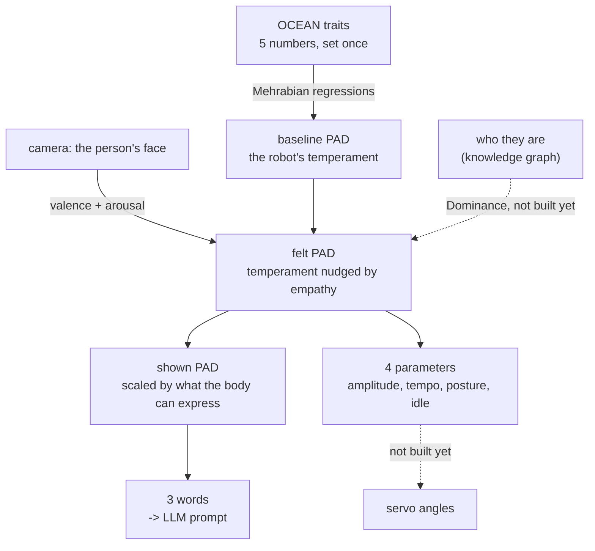

# How the affect model works, from the start

A robot with a fixed personality treats everyone the same. A robot that only
mirrors emotion has no personality at all. This is the machinery that lets it do
both: keep a stable character while still reacting to the person in front of it —
and lets two different robots share a design yet read as different creatures.

Everything below is implemented in [`affect.py`](affect.py) and verified by
[`test_affect.py`](test_affect.py). All numbers in this document were produced by
running that code, not by hand.

---

## 1. The problem it solves

Three things want to influence how the robot behaves, and they conflict:

| influence | wants to |
|---|---|
| its **personality** | stay the same, so it has a recognisable character |
| the **person's emotion** | change moment to moment, so it seems responsive |
| the **relationship** | change slowly, so familiarity can grow |

Wire them together naively and they fight — a persona setting gets overwritten by
a smile, or an empathic response gets flattened by the persona. The trick is to
put all three in **one continuous space** where each one owns a *different
direction*, so they add instead of competing.

That space is **PAD**: Pleasure, Arousal, Dominance.

```
personality  ->  sets the baseline position
emotion      ->  moves Pleasure and Arousal
relationship ->  moves Dominance
```

Nothing overwrites anything. Each influence pushes along its own axis.

---

## 2. The pipeline



Six stages. Four are built; two are marked.

---

## 3. Stage one — personality becomes a coordinate

The persona is five numbers on `[-1, +1]`, the **OCEAN** traits: Openness,
Conscientiousness, Extraversion, Agreeableness, Neuroticism. Zero means average.

Rather than wiring traits to motors directly, they go through PAD, using
Mehrabian's temperament regressions (as used by the ALMA model):

```
P  = 0.21·E + 0.59·A + 0.19·N
Ar = 0.15·O + 0.30·A − 0.57·N
D  = 0.25·O + 0.17·C + 0.60·E − 0.32·A
```

Read what dominates each line — it explains a lot of the behaviour:

- **Agreeableness** carries Pleasure (0.59). Warmth makes a robot pleasant.
- **Neuroticism** carries Arousal *negatively* (−0.57). See the caveat in §9.
- **Extraversion** carries Dominance (0.60). This is the trait that separates our
  two robots.

The two published personas:

| | O | C | E | A | N | → | P | Ar | D |
|---|---|---|---|---|---|---|---|---|---|
| CHATBOX | −0.5 | +0.2 | −0.6 | +0.6 | +0.2 | | **+0.27** | **−0.01** | **−0.64** |
| ELLEBOT | +0.5 | +0.4 | +0.7 | +0.6 | −0.4 | | **+0.42** | **+0.48** | **+0.42** |

Agreeableness is held equal at +0.6, so both are warm. Extraversion runs opposite,
which swings Dominance by more than a full unit. **That single trait is why they
feel like different characters before either one speaks.**

---

## 4. Stage two — the face becomes a coordinate

Russell's **circumplex** puts emotion on two axes: valence (pleasant ↔
unpleasant) and arousal (activated ↔ quiet). "Angry" and "sad" share low valence
but sit at opposite ends of arousal — a single positive/negative score would
collapse them.

Those two axes map onto PAD's Pleasure and Arousal almost one to one.

**Why only two axes, and why that is the point.** Faces reliably carry pleasure
and arousal — the two dimensions of core affect. Dominance is poorly recoverable
from expression: it reflects social standing between two parties, not a momentary
look. So the face is deliberately given **no vote on Dominance at all**. That
comes from recognising *who* the person is.

This is why a two-axis model is the right tool rather than a limitation: it is
silent on exactly the axis it should be silent on.

The camera side uses a model that reports valence and arousal directly
(`enet_b0_8_va_mtl`, EfficientNet-B0 trained on AffectNet), so no lookup table is
needed. A classifier-plus-lookup fallback exists in `CATEGORY_VA` for comparison.

---

## 5. Stage three — fusion

```
felt.P  = baseline.P  + empathy · (valence − baseline.P)
felt.Ar = baseline.Ar + empathy · (arousal − baseline.Ar)
felt.D  = baseline.D                                    ← untouched
```

`empathy` (default **0.60**) is how far the person's expression drags the robot
off its own temperament:

- `0.0` — ignores you completely, sits at its persona forever
- `0.6` — moves most of the way, but its character still shows
- `1.0` — pure mirror, no personality left

Because it is a fraction *of the gap*, a neutral face pulls the robot toward
neutral rather than away, and the robot always relaxes back to its baseline when
nothing is detected. That is the decay behaviour, for free, with no timer.

---

## 6. Stage four — the body

Two robots can hold the same temperament and still not show the same amount of
it. ELLEBOT has a wheeled base that can approach and turn, plus large fan ears
devoted to amplifying valence. CHATBOX is a fixed tabletop unit. Same feeling,
different bandwidth to express it.

```
shown = show_fraction · felt
```

| | show | why |
|---|---|---|
| CHATBOX | 0.30 | fixed tabletop, 12-DOF upper face |
| ELLEBOT | 1.00 | wheeled base, fan ears, 12-DOF upper face |

This is the layer that makes the *embodiment* matter independently of the
persona, and it is why the same trait vector lands in two different places.

---

## 7. Stage five — two outputs

The coordinate drives language and movement at the same time.

### Language: three words

Each axis is banded into a descriptor, and the triplet goes into the LLM system
prompt so word choice follows the affective state.

CHATBOX's published coordinate returns **"warm, calm, reserved"** — which is the
paper's own worked example, so the bands are calibrated against it.

### Movement: four parameters

```
amplitude = 0.75 + 0.45·Ar + 0.20·D      clamp 0.30 … 1.30
tempo     = 0.85 + 0.55·Ar + 0.15·D      clamp 0.50 … 1.60
posture   = 0.70·D  + 0.30·P             clamp −1 … +1
idle      = 0.45 + 0.40·Ar               clamp 0.05 … 1.00
```

| parameter | means | driven by |
|---|---|---|
| **amplitude** | how *far* a gesture travels from neutral | Arousal, then Dominance |
| **tempo** | how *fast* it plays | Arousal |
| **posture** | resting carriage of neck and shoulders, withdrawn ↔ open | Dominance, then Pleasure |
| **idle** | how often it stirs between gestures | Arousal |

**Pleasure is absent from amplitude and tempo on purpose.** Valence decides
*which* gesture plays — a wave rather than a slump. Arousal and Dominance decide
*how* it is performed. Mixing valence into speed would make a happy robot fast
and a sad robot slow, which is not what sadness looks like.

At rest, the two personas:

| | amplitude | tempo | posture | idle |
|---|---|---|---|---|
| CHATBOX | 0.62 | 0.75 | −0.37 | 0.45 |
| ELLEBOT | 1.05 | 1.18 | +0.42 | 0.64 |

Small slow gestures from a withdrawn posture, versus big quick ones from an open
posture. That is the paper's "a broad, brisk wave from ELLEBOT, a slow, gentle
one from CHATBOX" — as numbers rather than adjectives.

Note these are computed from **`felt`**, not `shown`. The body's display fraction
and amplitude describe the same restraint; applying both would count it twice.

---

## 8. Stage six — parameters to servo angles

**Not built yet.** The intended shape, three lines in the firmware:

```cpp
angle = neutral + amplitude * (moveset_angle - neutral);   // scale the travel
angle += posture * POSTURE_RANGE;                          // neck/shoulders only
stepDelay = BASE_DELAY / tempo;                            // the 900 ms timer
```

Amplitude scales each servo's excursion *from its neutral*, so a gentle wave is
the same gesture performed smaller rather than a different gesture. Posture
offsets only neck and shoulders — it is carriage, not expression. Tempo divides
the existing step timing. `idle` drives a new behaviour: a small spontaneous
movement every so often, so the robot does not look switched off while waiting.

Transport needs one new message alongside the existing tag names:

```
STYLE 1.06 1.18 +0.49 0.65
```

---

## 9. End to end, with real numbers

Both robots, same moment: a happy face in front of them.

**CHATBOX**

| stage | P | Ar | D | |
|---|---|---|---|---|
| baseline from traits | +0.266 | −0.009 | −0.643 | *mildly pleased* |
| face says happy | | | | v +0.80, a +0.50 |
| felt, empathy 0.60 | +0.586 | +0.296 | −0.643 | D unmoved |
| shown, body 30% | +0.176 | +0.089 | −0.193 | *mildly elated* |

→ prompt: **"warm, calm, reserved"**
→ movement: amplitude 0.76, tempo 0.92, posture −0.27, idle 0.57

**ELLEBOT**

| stage | P | Ar | D | |
|---|---|---|---|---|
| baseline from traits | +0.425 | +0.483 | +0.421 | *elated* |
| face says happy | | | | v +0.80, a +0.50 |
| felt, empathy 0.60 | +0.650 | +0.493 | +0.421 | D unmoved |
| shown, body 100% | +0.650 | +0.493 | +0.421 | *strongly elated* |

→ prompt: **"affectionate, lively, assertive"**
→ movement: amplitude 1.06, tempo 1.18, posture +0.49, idle 0.65

Same face, same instant. One responds warmly but quietly from a withdrawn
posture; the other responds brightly and expansively. Neither has left character.

---

## 10. What is established and what is a guess

Worth being clear about, because the two get cited very differently.

| | status |
|---|---|
| OCEAN → PAD equations | **Published.** Mehrabian via ALMA. Reproduces the paper's Table I to two decimals. |
| Russell's two axes for the face | **Published**, and the reason Dominance is excluded. |
| Descriptor bands | **Fitted** so CHATBOX returns the paper's own example. Surrounding words are mine. |
| `empathy = 0.60` | **Proposal.** Not specified anywhere. Tune with `[` and `]` in the demo. |
| `show`: 0.30 / 1.00 | **Proposal.** The paper describes ELLEBOT's extra channels but gives no number. |
| The four style equations | **Proposal.** Axis assignments follow the nonverbal literature; weights are tuning. |
| Parameters → servo angles | **Not written.** §8 is a sketch. |
| Relationship → Dominance | **Not written.** Needs the knowledge graph. |

### One quirk to resolve

In the published regressions, Neuroticism *raises* Pleasure (`+0.19N`) and
*lowers* Arousal (`−0.57N`). So a high-N persona comes out calm and faintly
pleasant rather than anxious. Set N to +0.7 in the explorer and it reports
"serene".

That is what the equations say, but anxiety normally reads as *high* arousal.
Either that arousal term means trait energy rather than momentary agitation, or
the sign convention differs from what you would expect. Worth confirming against
Mehrabian before a reviewer asks — the deployed config has `N = +0.3`, already
pulling arousal down by 0.17.

---

## 11. Where each piece lives

| stage | code |
|---|---|
| OCEAN → PAD | `affect.to_pad`, weights in `affect.WEIGHTS` |
| the two personas | `affect.ROBOTS` |
| face → valence/arousal | `webcam_demo.read_va` |
| fusion | `affect.feel`, gain in `affect.EMPATHY` |
| body scaling | `affect.show` |
| naming a coordinate | `affect.affect_name`, `affect.SECTORS` |
| descriptor words | `affect.descriptors`, `affect.BANDS` |
| the four parameters | `affect.gesture_style`, limits in `affect.STYLE_LIMITS` |
| whole chain in one call | `affect.pipeline` |

Run [`test_affect.py`](test_affect.py) to check all of it, or
[`webcam_demo.py`](webcam_demo.py) to watch it move against your own face.
